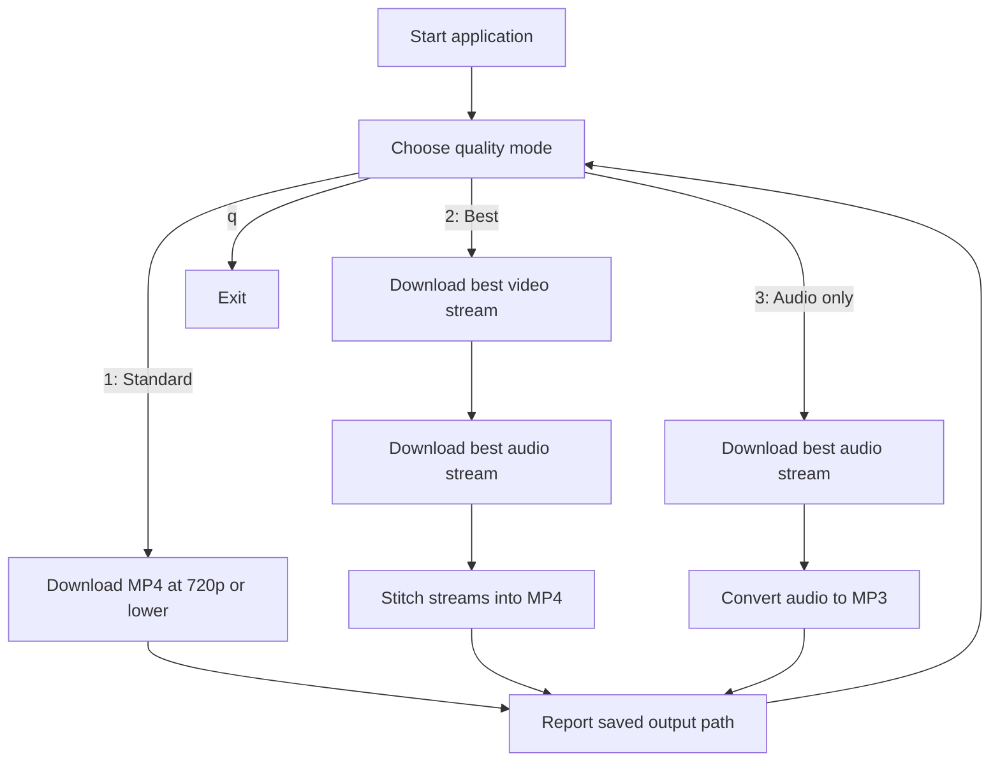
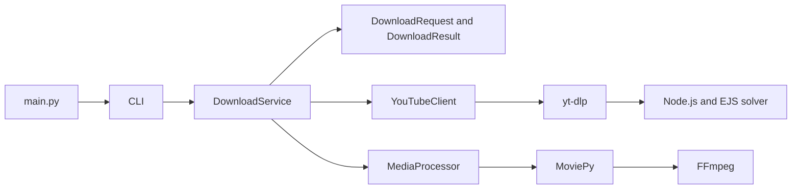

# YouTube Video Downloader

A command-line application that downloads YouTube video or audio using `yt-dlp`, then uses MoviePy and FFmpeg to produce the requested final media file.

Only download media you are permitted to download and use in accordance with YouTube's Terms of Service and applicable copyright law.

## Features

- Download an MP4 video at up to 720p.
- Download the best available video and audio streams, then stitch them into an MP4 file.
- Download audio and convert it to MP3.
- Sanitize video titles before using them as filenames.
- Use Node.js and yt-dlp's EJS component to handle YouTube JavaScript challenges.

## Requirements

| Requirement | Purpose |
| --- | --- |
| Python 3.11 or later | Runs the application. |
| Node.js | Allows yt-dlp to solve YouTube JavaScript challenges. |
| FFmpeg | Converts downloaded media and supports MoviePy processing. |
| Internet access | Retrieves video metadata and media streams. |

Ensure `python`, `node`, and `ffmpeg` are available on your `PATH` before running the application.

## Setup

Install the runtime dependencies from the repository root:

```powershell
python -m pip install -r requirements.txt
```

For testing and development, install the additional tools:

```powershell
python -m pip install -r requirements-dev.txt
```

## Run

Run the application from the repository root:

```powershell
python main.py
```

Or use a launcher that works from any current directory:

```powershell
.\run.ps1
```

On macOS or Linux, make the script executable once and then run it:

```sh
chmod +x run.sh
./run.sh
```

The PowerShell script finds `python` or the Windows `py` launcher. The shell script prefers `python3` and falls back to `python`.

## Using the CLI

At the prompt, enter one of these choices:

| Choice | Result |
| --- | --- |
| `1` | Downloads the best MP4 stream at 720p or lower. |
| `2` | Downloads the highest available H.264 MP4 video stream and best audio stream, then combines them into one MP4 file. |
| `3` | Downloads the best audio stream and converts it to an MP3 file. |
| `q` | Exits the application. |

After choosing a mode, paste a full YouTube video URL. The final file is written to the directory where the application is run. The application displays its saved path after completion.

Invalid menu choices and empty URLs are reported and return to the menu. Download, YouTube, or media-conversion failures are displayed without exiting the application, so another request can be made.

## Download Workflows



Temporary files created by the best-quality and audio-only workflows are removed after a successful stitch or conversion. Downloaded media files are excluded from Git by `.gitignore`.

## Architecture



| Component | Responsibility |
| --- | --- |
| `main.py` | Starts the application. |
| `downloader/cli.py` | Presents the menu, validates input, and reports results or failures. |
| `downloader/models.py` | Defines the supported quality modes and structured download request/result values. |
| `downloader/service.py` | Coordinates the selected workflow and returns the final output path. |
| `downloader/youtube_client.py` | Retrieves metadata, chooses yt-dlp formats, downloads media, and configures the Node.js/EJS runtime. |
| `downloader/media_processor.py` | Stitches best-quality audio/video streams and converts audio to MP3. |

## Output Files

| Mode | Final file | Temporary files |
| --- | --- | --- |
| Standard | `<title>.mp4` | None |
| Best available | `<title>.mp4` | `<title>_video.mp4`, `<title>_audio.mp4` |
| Audio only | `<title>.mp3` | `<title>_audio.mp4` |

Temporary files are removed after successful processing. If processing is interrupted, remove leftover temporary files manually before retrying.

## Videos Rejected by YouTube

YouTube may reject an otherwise public video's media stream with `HTTP 403`, even when metadata is available. This is controlled by YouTube and can be specific to a video, player session, or network. The app reports this condition without creating a final file. Follow [issue #6](https://github.com/AnirudhPotturi/YouTubeVideoDownloader/issues/6) for the planned reliability improvements.

For videos that require an authenticated session, sign in to YouTube in a local browser and set `YTDLP_COOKIES_FROM_BROWSER` before starting the app. Supported values include `chrome`, `edge`, and `firefox`.

```powershell
$env:YTDLP_COOKIES_FROM_BROWSER = "edge"
.\run.ps1
```

The app reads the browser's cookie store only when this variable is set. Do not commit cookies or browser-profile data to the repository.

## Testing

Integration tests use a real public YouTube URL and require network access, Node.js, and FFmpeg. They are skipped unless `YOUTUBE_INTEGRATION_URL` is explicitly provided.

```powershell
$env:YOUTUBE_INTEGRATION_URL = "https://www.youtube.com/watch?v=ePOglweqy7o"
python -m pytest -m integration
```

The integration suite verifies live metadata retrieval and the audio-only download, conversion, and temporary-file cleanup flow.